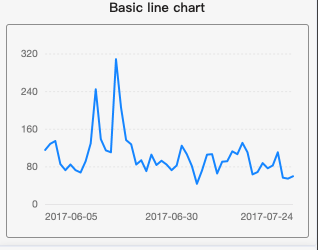
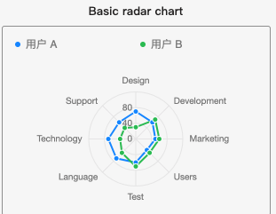

## Full examples of using jw-f2 in wechat miniprogram

### Example Gallery
- Lines
  - [Basic Line](./components/lines/BasicLine/index.js)
  > 
- Radars
  - [Basic Radar](./components/radars/BasicRadar/index.js)
  > 

### Support this project
- Buy me a coffee

  

- Make a contribution
> - All charts based on the [@antv/f2 official website](https://antv-f2.gitee.io/zh/examples/gallery) are welcome.
> - Charts based on @antv/f2 but not listed in the gallery are prefered.
> - Welcome to star and fork this project and submit a pr.